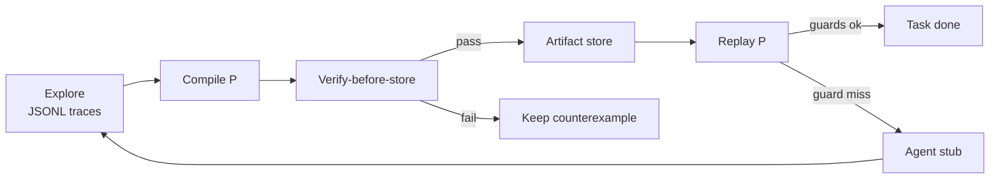

# agent-distillation-bench

把 Agent 的成功轨迹编译成**可验证、可复用的确定性程序**，再在生产路径上当普通软件跑。

Agent 出现在**编译期**和**偏移期**；执行面默认不是再推理一遍。

本仓库的 v0 范围与拍板见 [RFC-0001](docs/rfc-0001-compile-loop.md) / [issue #1](https://github.com/loootte/agent-distillation-bench/issues/1)。

## 问题

传统软件把边界收在设计期。Agent 擅长探索，但不该把同一条已验证路径推理第一千遍。

给定任务族 \(\mathcal{T}\) 与轨迹 \(\{\tau_i\}\)：

1. **Compile** 产出确定性工件 \(P\)（v0：参数化 Python 函数）
2. **Verify** 在干净环境重放 \(P\)，独立 checker 判定任务是否真正完成（覆盖率 ≠ 完成）
3. **Replay** 同类任务优先执行 \(P\)
4. **Fallback** 守卫失败时交回 Agent，并留下再编译候选

## 架构



v0 运行时调度：

```text
if store.hit(task) and guards_ok:
    run(P)
else:
    run(agent_stub)   # 重放已有成功轨迹，不接真实 LLM
```

## v0 竖切（已锁定）

| 项 | 决定 |
|---|---|
| 玩具域 | 进程内工单 API（`examples/toy_domain/`） |
| 编译产物 | 参数化 Python 函数入库；可选状态机 IR |
| LLM | v0 **不接**；用录制轨迹打通闭环 |

明确不做：通用 `except` 式运行时自愈、只写 SKILL.md、开放世界创意任务、技能市场、GUI Computer-Use、多 Agent 编排。

## 仓库结构

```text
schema/trace.schema.json     # JSONL 轨迹 schema
src/compile/                 # 轨迹 → Program
src/verify/                  # 干净环境重放 + 独立 checker
src/store/                   # verify 通过才入库
src/runtime/                 # hit + guards → P，否则 stub
examples/toy_domain/         # 任务、轨迹、期望产物、反例
docs/rfc-0001-compile-loop.md
```

## 快速跑通

需要 Python 3.11+。在仓库根目录：

```bash
python -m unittest discover -s tests -v
```

验证门必须拒绝「步骤走完但工单仍未关闭」的假程序，见 `tests/test_verify_rejects_false_success.py`。

## 评测（后续 issue 落地）

冷启动成本、热启动延迟 / 费用、编译保真率、守卫触发率、微扰衰减。不要只报一次成功率。

## 相关工作

- [PreAct](https://arxiv.org/abs/2606.17929) — 轨迹 → 状态机；verify-before-store
- [Skill-DisCo](https://arxiv.org/abs/2606.26669) — 轨迹 → 可执行过程子图
- [Compiled AI](https://arxiv.org/abs/2604.05150) / [PlanCompiler](https://arxiv.org/abs/2604.13092) — 编译期模型，运行期确定性代码
- [Trace2Policy](https://arxiv.org/abs/2606.10457) — 规则 → 零 LLM Python

## 许可

MIT。见 [LICENSE](LICENSE)。
